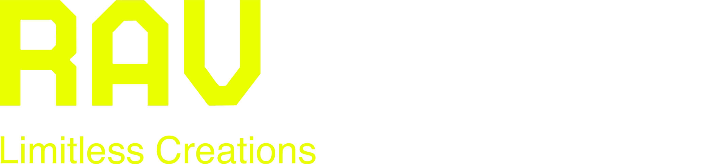
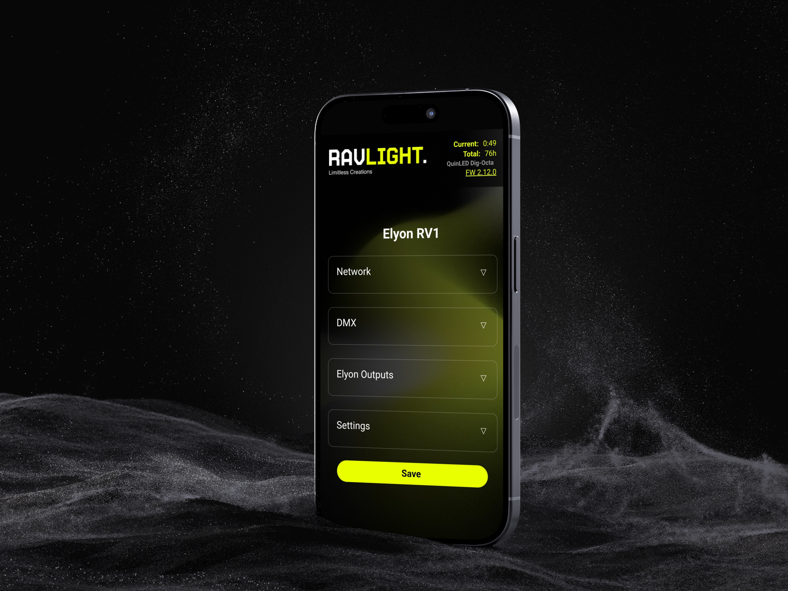

<div align="center">
  <br><br>
  <strong>Open-source modular firmware for networked stage lighting nodes</strong><br>
  <sub>ArtNet · sACN/E1.31 · DMX512 · ESP32 · PlatformIO</sub>

  <br><br>

  
  
  
  
</div>

---

<div align="center">
  
</div>

---

## What is RavLight?

RavLight Core is a professional-grade firmware platform for **ESP32-based DMX lighting nodes**. Think WLED, but designed from the ground up for **DMX512 control**, multi-universe ArtNet/sACN reception, and real fixture personalities — not just pixel strips.

Every feature is a **compile-time flag**: you ship only what the hardware needs. Porting to a new board takes one header file. Adding a new fixture is a self-contained module.

---

## Protocols

| Protocol | Transport | Role |
|---|---|---|
| **ArtNet** | UDP 6454 · ETH + WiFi simultaneously | DMX over IP (industry standard) |
| **sACN / E1.31** | UDP 5568 · per-universe multicast | ESTA standard streaming DMX |
| **DMX512** | RS-485 physical | Wired DMX input and output node |
| **mDNS** | UDP multicast | Zero-config device discovery (`ravXXX.local`) |
| **ESP-NOW** | 802.11 layer | Low-latency wireless discovery |
| **UDP broadcast** | LAN | Device discovery from master controller |

ArtNet and sACN receivers use native **lwIP sockets** — a single socket binds `INADDR_ANY` and works across Ethernet, WiFi STA, and SoftAP simultaneously with no library overhead.

---

## Architecture

RavLight is organized in three tiers. Each tier is compiled only when its flag is set.

```
┌─────────────────────────────────────────────────────┐
│  CORE  (always compiled)                            │
│  config · network · webserver · dmx_manager         │
│  runtime · discovery_udp · discovery_espnow         │
└──────────────────┬──────────────────────────────────┘
                   │
        ┌──────────▼──────────┐
        │  MODULES (opt-in)   │
        │  RAVLIGHT_MODULE_*  │
        └──────────┬──────────┘
                   │
        ┌──────────▼──────────┐
        │  FIXTURES           │
        │  RAVLIGHT_FIXTURE_* │
        └─────────────────────┘
```

### Core
Always compiled. Provides networking (Ethernet + WiFi + SoftAP fallback), multi-universe DMX pool (up to 32 universes), web server, NVS-persisted config (survives filesystem updates), mDNS, and ESP-NOW/UDP discovery slave.

### Modules  `RAVLIGHT_MODULE_*`

| Flag | Feature |
|---|---|
| `ETHERNET` | LAN8720 Ethernet with automatic WiFi fallback |
| `DMX_PHYSICAL` | Wired RS-485 DMX512 input and output (DMX node) |
| `RECORDER` | Scene recorder — 4 slots × 10 s @ 40 fps on LittleFS; loop playback via Auto Scene |
| `TEMP` | LM35 analog temperature sensor, exposed on `/temperature` |
| `RESET` | Physical reset button — hold 10 s to factory reset |

### Fixtures  `RAVLIGHT_FIXTURE_*`

| Fixture | Description | Status |
|---|---|---|
| **Veyron** | Pixel bar — 40× WS2811 RGB + 2× P9813 accent; 5 DMX personalities; strobe and highlight animations | Stable |
| **Elyon** | 8-output LED controller — each output independently configurable; WS2811 / WS2812B / SK6812 / WS2814 RGBW with per-output color order; multi-universe span | Alpha |
| **Axon** | ArtNet / sACN → RS-485 DMX node | Planned |

---

## Boards

Board files live in `boards/` and are force-included at compile time via `-include`. Porting to new hardware = one new header file.

| Board file | MCU | Connectivity | Used with |
|---|---|---|---|
| `boards/xdmx_v2.h` | ESP32 WT32-ETH01 | LAN8720 Ethernet + WiFi | Veyron |
| `boards/quinled_octa.h` | ESP32-WROOM-32UE | LAN8720 Ethernet + WiFi | Elyon |
| `boards/generic_esp32_eth.h` | ESP32 + LAN8720 | Ethernet + WiFi | Template |

---

## Applications

- **Pixel bars and LED fixtures** — precise multi-universe DMX control over Ethernet or WiFi
- **ArtNet / sACN nodes** — receive from any lighting console and drive physical DMX lines
- **Touring and installation lighting** — Ethernet primary, WiFi fallback, SoftAP provisioning
- **Scene playback** — standalone loop without a console via the built-in scene recorder
- **DIY professional fixtures** — modular platform to build custom lighting hardware

---

## Web UI

Accessible from any browser. No app required.

- **Network** — Ethernet/WiFi config, DHCP or static IP, mDNS hostname, live connection status
- **DMX** — source selection (ArtNet / sACN / Wired / Auto Scene), universe, output node toggle
- **Fixture** — per-fixture parameters (personalities, pixel count, color order, brightness…)
- **Settings** — fixture ID, config export/import (JSON), OTA firmware update
- Live parameter changes applied instantly — restart only when network/ID params change
- Config stored in NVS — survives `uploadfs` and OTA filesystem updates

---

## Quick Start

**Requirements:** [PlatformIO](https://platformio.org/) CLI or IDE extension.

```bash
git clone https://github.com/Ravision92/ravlight-core.git
cd ravlight-core

# build
pio run -e xdmx_v2_veyron

# flash firmware
pio run -e xdmx_v2_veyron --target upload

# upload web UI filesystem
pio run -e xdmx_v2_veyron --target uploadfs

# serial monitor
pio device monitor
```

> **First boot** — device starts in SoftAP mode. Connect to the `Veyron-RVXXXX` network and open `192.168.4.1` to configure.

### Full flash (first install / migration from WLED)

Each build also produces a **single merged binary** combining bootloader, partition table, firmware and filesystem. Flash it in one command — no addresses to remember:

```bash
esptool.py --chip esp32 write_flash --compress 0x0 release/veyron_hw2.2_v2.12.0.bin
```

---

## Status

| Feature | |
|---|---|
| Core — ArtNet + sACN native lwIP | ✅ |
| Physical DMX512 IN/OUT | ✅ |
| Multi-universe pool (32 universes) | ✅ |
| LittleFS web UI + NVS config | ✅ |
| Scene Recorder (4 slots, loop playback) | ✅ |
| Veyron fixture — WS2811 + P9813, 5 personalities | ✅ |
| Elyon fixture — 8× output, RGBW, color order | ✅ Alpha |
| Merged release binary (fw + fs) | ✅ |
| ESP-NOW + UDP discovery slave | ✅ |
| OTA firmware update via web UI | ✅ |
| Axon DMX node fixture | 📋 Planned |
| SD card scene manager | 📋 Planned |
| React Native device app | 📋 Planned |
| NFC provisioning | 📋 Planned |

---

## License

RavLight Core is dual-licensed:

- **[AGPLv3](LICENSE)** — free for open-source and personal use
- **[Commercial license](DUAL%20LICENSE.md)** — required for closed-source or commercial products

---

<div align="center">
  <sub>Built by <a href="https://github.com/Ravision92">Ravision92</a></sub>
</div>
