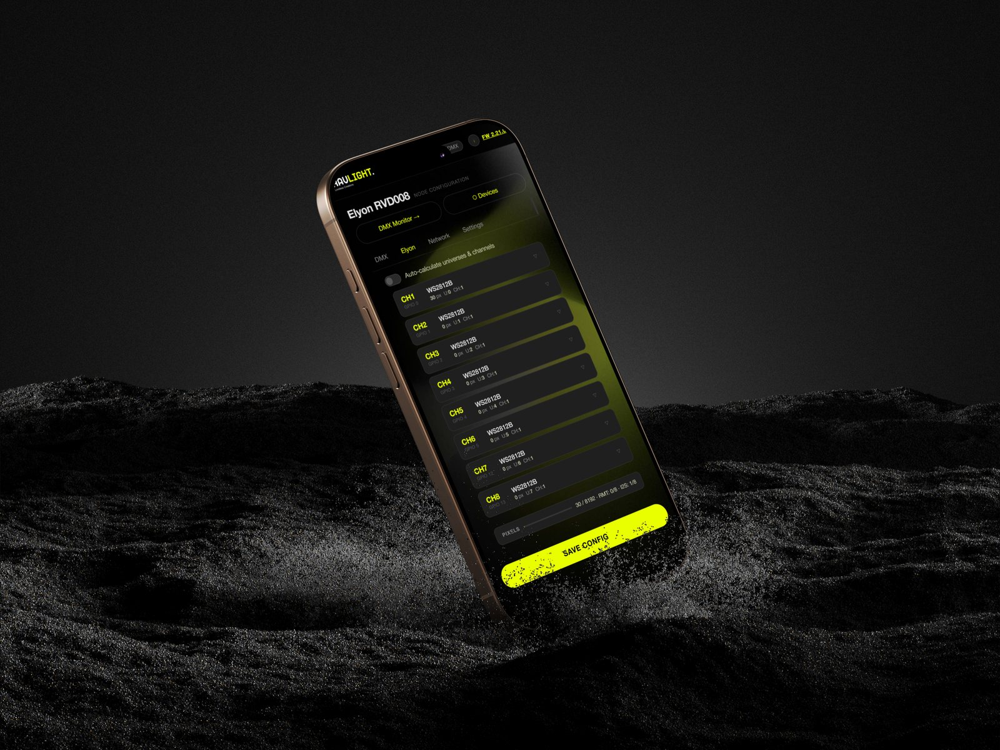

<div align="center">
  <br><br>
  <strong>Open-source modular firmware for networked stage lighting nodes</strong><br>
  <sub>ArtNet · sACN/E1.31 · DMX512 · ESP32 · PlatformIO</sub>

  <br><br>

  <strong><a href="https://ravlight.com">ravlight.com</a></strong> — website · browser installer · documentation

  <br><br>

  
  
  
  
</div>

---

<div align="center">
  
</div>

---

## What is RavLight?

RavLight Core is a professional-grade firmware platform for **ESP32-based DMX lighting nodes**, designed from the ground up for **DMX512 control**, multi-universe ArtNet/sACN reception, and real fixture personalities — not just pixel strips.

Every feature is a **compile-time flag**: you ship only what the hardware needs. Porting to a new board takes one header file. Adding a new fixture is a self-contained module.

---

## Protocols

| Protocol | Transport | Role |
|---|---|---|
| **ArtNet** | UDP 6454 · ETH + WiFi simultaneously | DMX over IP (industry standard) |
| **sACN / E1.31** | UDP 5568 · per-universe multicast | ESTA standard streaming DMX |
| **DMX512** | RS-485 physical | Wired DMX input and output node |
| **mDNS** | UDP multicast | Zero-config device discovery (`ravXXX.local`) |
| **ESP-NOW** | 802.11 layer | Low-latency wireless discovery |
| **UDP broadcast** | LAN | Device discovery from master controller |

ArtNet and sACN receivers use native **lwIP sockets** — a single socket binds `INADDR_ANY` and works across Ethernet, WiFi STA, and SoftAP simultaneously with no library overhead.

---

## Architecture

RavLight is organized in three tiers. Each tier is compiled only when its flag is set.

```
┌─────────────────────────────────────────────────────┐
│  CORE  (always compiled)                            │
│  config · network · webserver · dmx_manager         │
│  runtime · discovery_udp · discovery_espnow         │
└──────────────────┬──────────────────────────────────┘
                   │
        ┌──────────▼──────────┐
        │  MODULES (opt-in)   │
        │  RAVLIGHT_MODULE_*  │
        └──────────┬──────────┘
                   │
        ┌──────────▼──────────┐
        │  FIXTURES           │
        │  RAVLIGHT_FIXTURE_* │
        └─────────────────────┘
```

### Core
Always compiled. Provides networking (Ethernet + WiFi + SoftAP fallback), multi-universe DMX pool (up to 32 universes), web server, NVS-persisted config (survives filesystem updates), mDNS, and ESP-NOW/UDP discovery slave.

### Modules  `RAVLIGHT_MODULE_*`

| Flag | Feature |
|---|---|
| `ETHERNET` | LAN8720 Ethernet with automatic WiFi fallback |
| `DMX_PHYSICAL` | Wired RS-485 DMX512 input and output (DMX node) |
| `RECORDER` | Scene recorder — 4 slots × 10 s @ 40 fps on LittleFS; loop playback via Auto Scene |
| `EFFECTS` | Built-in effects engine — 5 fixture-aware effects (Solid, Rainbow, Chase, Fire, Twinkle) with live-preview from the UI, no external controller required |
| `OLED` | SSD1306/SSD1309 128×64 status display via I²C — fixture ID + IP + source FPS + DMX activity pill |
| `DISCOVERY` | Device discovery over UDP + ESP-NOW — devices see each other across a network; "Send WiFi" pushes credentials to a target device from the master |
| `TEMP` | LM35 analog temperature sensor, exposed on `/temperature` |
| `RESET` | Physical reset button — hold 10 s to factory reset |

### Fixtures  `RAVLIGHT_FIXTURE_*`

| Fixture | Description | Status |
|---|---|---|
| **Veyron** | Pixel bar — 40× WS2811 RGB + 2× P9813 accent; 5 DMX personalities; strobe and highlight animations | Stable |
| **Elyon** | Multi-output LED controller — 2 to 15 outputs per board, each independently configurable; WS2811 / WS2812B / SK6812 / WS2814 / WS2815 / TM1814 / TM1914 RGBW, APA102 / SK9822 / P9813 clocked chipsets, PWM dimmer, relay; per-output color order, brightness, grouping, multi-universe span; I2S parallel backend (default) or RMT per-channel | Alpha |
| **Orion** | Motorized winch — TMC2209 stepper (LED Lifter v5): DMX position/speed with 3 personalities, sensorless StallGuard homing, manual jog, DMX-loss watchdog, mechanical calibration, plus optional WS281x LED outputs driven alongside the motor | Alpha (hardware pending) |
| **Axon** | ArtNet / sACN → RS-485 DMX bridge (XDMX v1.4): live channel offset for daisy-chained slice-out, optional 2 accent LED outputs, SSD1306 OLED status display, source FPS on the fixture panel | Alpha |

---

## Boards

Board files live in `boards/` and are force-included at compile time via `-include`. Porting to new hardware = one new header file.

| Board | Build environment | Outputs | Connectivity | Merged binary |
|---|---|---|---|---|
| XDMX rev2.2 (WT32-ETH01) | `xdmx_v2_veyron` | — | LAN8720 ETH + WiFi | `veyron_xdmx2_vX.Y.Z.bin` |
| QuinLED Dig-Octa Brainboard-32-8L | `quinled_octa_elyon` | 8 × pixel/PWM | LAN8720 ETH + WiFi | `elyon_quinled_octa_vX.Y.Z.bin` |
| QuinLED AN-Penta Plus | `quinled_penta_plus_elyon` | 6 × PWM + 1 × relay | LAN8720 ETH + WiFi | `elyon_quinled_penta_plus_vX.Y.Z.bin` |
| QuinLED AN-Penta Deca | `quinled_penta_deca_elyon` | 15 × PWM | WiFi only | `elyon_quinled_penta_deca_vX.Y.Z.bin` |
| Gledopto Elite 4D-EXMU (GL-C-618WL) | `gledopto_elite4d_elyon` | 4 × pixel/PWM | LAN8720 ETH + WiFi | `elyon_gledopto_elite4d_vX.Y.Z.bin` |
| Gledopto Elite 2D-EXMU (GL-C-616WL) | `gledopto_elite2d_elyon` | 2 × pixel/PWM | LAN8720 ETH + WiFi | `elyon_gledopto_elite2d_vX.Y.Z.bin` |
| LED Lifter v5 (ESP32-WROOM-32E) | `led_lifter_v5_orion` | TMC2209 winch + 4 × pixel | LAN8720 ETH + WiFi | `orion_led_lifter_v5_vX.Y.Z.bin` |
| XDMX v1.4 (QuinLED-ESP32-AE) | `xdmx_v1_4_axon` | RS-485 DMX bridge + 2 × pixel | LAN8720 ETH + WiFi + OLED I²C | `axon_xdmx_v1_4_vX.Y.Z.bin` |

---

## Applications

- **Pixel bars and LED fixtures** — precise multi-universe DMX control over Ethernet or WiFi
- **ArtNet / sACN nodes** — receive from any lighting console and drive physical DMX lines
- **Touring and installation lighting** — Ethernet primary, WiFi fallback, SoftAP provisioning
- **Scene playback** — standalone loop without a console via the built-in scene recorder
- **DIY professional fixtures** — modular platform to build custom lighting hardware

---

## Web UI

Accessible from any browser. No app required.

- **Network** — Ethernet/WiFi config, DHCP or static IP, mDNS hostname, live connection status
- **DMX** — source selection (ArtNet / sACN / Wired / Auto Scene / Built-in Effects), universe, output node toggle with channel offset for daisy-chained slice-out
- **Fixture** — per-fixture parameters (personalities, pixel count, color order, brightness…)
- **Effects** — live-preview built-in engine, colour picker, speed / intensity, plus fixture-specific extras (Veyron: white accent + strobe RGB / strobe White)
- **Info popup** — one-click device summary: IP, mDNS, connection type, WiFi signal, DMX source FPS, temperature, uptime, total hours, board, firmware
- **Devices panel** — scan the LAN for other RavLight nodes (UDP + ESP-NOW), highlight, remote reset, "Send WiFi" to push credentials to a target device
- **Settings** — fixture ID, config export/import (JSON), OTA firmware update
- Every parameter is live-applied — no restart on DMX source change, fixture personality tweaks, effect edits or LED output reconfig; restart only when network/ID params change
- Config stored in NVS — survives `uploadfs` and OTA filesystem updates

---

## Quick Start

**Requirements:** [PlatformIO](https://platformio.org/) CLI or IDE extension.

```bash
git clone https://github.com/Ravision92/ravlight-core.git
cd ravlight-core

# build
pio run -e xdmx_v2_veyron

# flash firmware
pio run -e xdmx_v2_veyron --target upload

# upload web UI filesystem
pio run -e xdmx_v2_veyron --target uploadfs

# serial monitor
pio device monitor
```

> **First boot** — device starts in SoftAP mode. Connect to the `Veyron-RVXXXX` network and open `192.168.4.1` to configure.

### Full flash — first install

Each build produces a **single merged binary** in `release/` that combines bootloader, partition table, firmware and filesystem into one file. You flash it at address `0x0` — no manual address list needed.

> **Easiest: the web installer at [ravlight.com/install.html](https://ravlight.com/install.html)** — pick fixture + board and flash straight from Chrome/Edge, no tools. The manual options below remain for offline use or unsupported browsers.

#### Option A — browser (no tools required)

1. Open **[esptool-js](https://espressif.github.io/esptool-js/)** in Chrome or Edge (WebSerial required — Firefox not supported)
2. Connect the board via USB-to-UART adapter (CP2102, CH340, FT232…). Most QuinLED and Gledopto boards do **not** have a built-in USB-serial chip.
3. Enter flash mode:
   - Hold the **BOOT** button, press **RESET**, then release BOOT — the chip is now ready to receive firmware
   - Some boards enter flash mode automatically when esptool connects
4. In esptool-js: click **Connect**, select the COM port, set **Baudrate 460800**
5. Click **Erase Flash** (recommended on first install — clears any previous firmware)
6. Under "Flash", set **Flash Address `0x0`**, then click the file picker and select the merged binary for your board:

| Board | File |
|---|---|
| QuinLED Dig-Octa | `elyon_quinled_octa_vX.Y.Z.bin` |
| QuinLED AN-Penta Plus | `elyon_quinled_penta_plus_vX.Y.Z.bin` |
| QuinLED AN-Penta Deca | `elyon_quinled_penta_deca_vX.Y.Z.bin` |
| Gledopto Elite 4D-EXMU | `elyon_gledopto_elite4d_vX.Y.Z.bin` |
| Gledopto Elite 2D-EXMU | `elyon_gledopto_elite2d_vX.Y.Z.bin` |
| LED Lifter v5 (Orion) | `orion_led_lifter_v5_vX.Y.Z.bin` |
| XDMX rev2.2 | `veyron_xdmx2_vX.Y.Z.bin` |

7. Click **Program** and wait for completion
8. Press **RESET** — the device boots and creates a SoftAP (`Elyon-RVXXXX` or `Veyron-RVXXXX`)
9. Connect to the AP and open `192.168.4.1` to configure network and outputs

#### Option B — command line

```bash
esptool.py --chip esp32 write_flash --compress 0x0 release/elyon/vX.Y.Z/elyon_quinled_octa_vX.Y.Z.bin
```

Release artefacts are grouped per fixture: `release/{veyron,elyon,orion}/vX.Y.Z/`. Each folder contains the merged `*_vX.Y.Z.bin` for first-time flashing, plus the app-only `*_fw_vX.Y.Z.bin` for OTA. The web UI is embedded in the firmware image, so an OTA is a single file — no separate filesystem image to upload.

> **Subsequent OTA updates** — once the device is on the network, click the **FW x.xx** badge in the header to open the Firmware panel. Two ways to update:
> - **Automatic** — *Check for updates* queries the RavLight feed and, if a newer version exists, offers *Update now* (downloads and installs the app image, then reboots and verifies the new version is running).
> - **Manual** — *Manual update (upload .bin)* flashes a local `*_fw_vX.Y.Z.bin` directly. Works offline and with any build.
>
> Either way the device reboots and the panel confirms the running version (with automatic rollback if the new image fails to boot).

---

## Status

| Feature | |
|---|---|
| Core — ArtNet + sACN native lwIP | ✅ |
| Physical DMX512 IN/OUT | ✅ |
| Multi-universe pool (32 universes) | ✅ |
| LittleFS web UI + NVS config | ✅ |
| Scene Recorder (4 slots, loop playback) | ✅ |
| Veyron fixture — WS2811 + P9813, 5 personalities | ✅ |
| Elyon fixture — 2–15 outputs, pixel/PWM/relay, RGBW | ✅ Alpha |
| Orion fixture — TMC2209 winch + LED outputs, StallGuard calibration wizard | 🧪 Alpha (hardware pending) |
| QuinLED Dig-Octa / Penta Plus / Penta Deca boards | ✅ |
| Gledopto Elite 4D / 2D-EXMU boards | ✅ |
| Board-specific first-boot output presets | ✅ |
| Merged release binary (one file, address 0x0) | ✅ |
| ESP-NOW + UDP discovery slave | ✅ |
| OTA firmware update via web UI | ✅ |
| Axon DMX node fixture | 📋 Planned |
| SD card scene manager | 📋 Planned |
| React Native device app | 📋 Planned |
| NFC provisioning | 📋 Planned |

---

## License

RavLight Core is dual-licensed:

- **[AGPLv3](LICENSE)** — free for open-source and personal use
- **[Commercial license](DUAL%20LICENSE.md)** — required for closed-source or commercial products

---

<div align="center">
  <sub>Built by <a href="https://github.com/Ravision92">Ravision92</a></sub>
</div>
