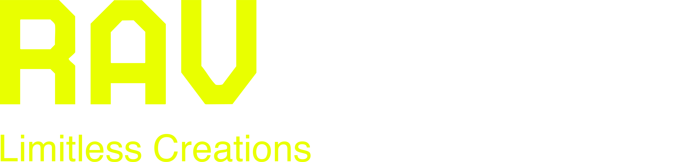
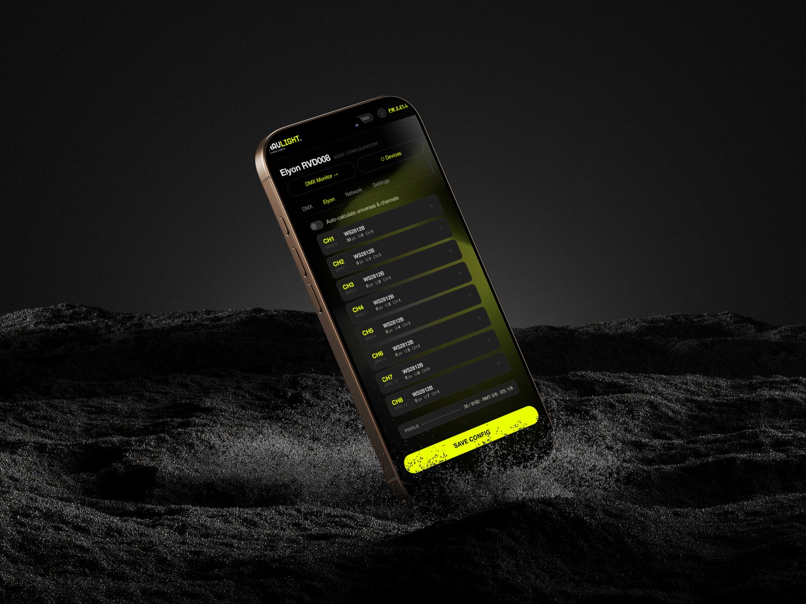

<div align="center">
  <br><br>
  <strong>Open-source modular firmware for networked stage lighting nodes</strong><br>
  <sub>ArtNet · sACN/E1.31 · DMX512 · ESP32 · PlatformIO</sub>

  <br><br>

  <strong><a href="https://ravlight.com">ravlight.com</a></strong> — website · browser installer · documentation

  <br><br>

  
  
  
  
</div>

---

<div align="center">
  
</div>

---

## What is RavLight?

RavLight Core is a professional-grade firmware platform for **ESP32-based DMX lighting nodes**, designed from the ground up for **DMX512 control**, multi-universe ArtNet/sACN reception, and real fixture personalities — not just pixel strips.

Every feature is a **compile-time flag**: you ship only what the hardware needs. Porting to a new board takes one header file. Adding a new fixture is a self-contained module.

### Where things are

| | |
|---|---|
| 🌐 **Website** | **[ravlight.com](https://ravlight.com)** — the project's home |
| ⚡ **Browser installer** | [ravlight.com/install.html](https://ravlight.com/install.html) — flash a board from Chrome or Edge, no toolchain |
| 📖 **Documentation** | [ravlight.com/docs/getting-started.html](https://ravlight.com/docs/getting-started.html) — first steps, per-fixture guides, protocols, web UI |
| 🛰️ **Polaris** | [ravlight.com/docs/polaris.html](https://ravlight.com/docs/polaris.html) — the fleet manager for a whole rig |
| 🧩 **Fixtures & collaborations** | [ravlight.com/projects.html](https://ravlight.com/projects.html) — the hardware RavLight runs on, and how to bring your own |
| 📦 **Releases** | [github.com/Ravision92/ravlight-core/releases](https://github.com/Ravision92/ravlight-core/releases) — binaries per board |
| 📷 **Instagram** | [@ravlight_](https://instagram.com/ravlight_) |

---

## Protocols

| Protocol | Transport | Role |
|---|---|---|
| **ArtNet** | UDP 6454 · ETH + WiFi simultaneously | DMX over IP (industry standard) |
| **sACN / E1.31** | UDP 5568 · per-universe multicast | ESTA standard streaming DMX |
| **DMX512** | RS-485 physical | Wired DMX input and output node |
| **RDM** | RS-485 · ANSI E1.20 | Personality and start address from the console; ArtRDM discovery over IP |
| **mDNS** | UDP multicast | `ravXXX.local`, plus a `_ravlight._tcp` service record carrying name, fixture, board and version |
| **ESP-NOW** | 802.11 layer | Low-latency wireless discovery |
| **UDP broadcast** | LAN · 4210 / 4211 | Device discovery — also what [Polaris](https://ravlight.com/docs/polaris.html) speaks |

ArtNet and sACN receivers use native **lwIP sockets** — a single socket binds `INADDR_ANY` and works across Ethernet, WiFi STA, and SoftAP simultaneously with no library overhead.

---

## Architecture

RavLight is organized in three tiers. Each tier is compiled only when its flag is set.

```
┌─────────────────────────────────────────────────────┐
│  CORE  (always compiled)                            │
│  config · network · webserver · dmx_manager         │
│  runtime · dmx_patch · discovery responder          │
└──────────────────┬──────────────────────────────────┘
                   │
        ┌──────────▼──────────┐
        │  MODULES (opt-in)   │
        │  RAVLIGHT_MODULE_*  │
        └──────────┬──────────┘
                   │
        ┌──────────▼──────────┐
        │  FIXTURES           │
        │  RAVLIGHT_FIXTURE_* │
        └─────────────────────┘
```

### Core
Always compiled. Provides networking (Ethernet + WiFi + SoftAP fallback), multi-universe DMX pool (up to 32 universes), web server with the UI embedded in the firmware image, NVS-persisted config, mDNS, and the discovery responder that answers a scan from another device or from Polaris.

### Modules  `RAVLIGHT_MODULE_*`

| Flag | Feature |
|---|---|
| `ETHERNET` | LAN8720 Ethernet with automatic WiFi fallback |
| `DMX_PHYSICAL` | Wired RS-485 DMX512 input and output (DMX node) |
| `DMX_PHYSICAL_2` | A second independent RS-485 port |
| `RECORDER` | Scene recorder — 4 slots × 10 s @ 40 fps on LittleFS; loop playback via Auto Scene |
| `EFFECTS` | Built-in effects engine — fixture-aware effects (Solid, Rainbow, Chase, Fire, Twinkle, sweeps) with live preview from the UI, no external controller required |
| `OLED` | SSD1306/SSD1309 128×64 status display via I²C — fixture ID + IP + source FPS + DMX activity pill |
| `DISCOVERY` | Active scanning and the Devices panel — find other RavLight nodes on the LAN, open them, highlight, reset |
| `ESPNOW` | Compiles the ESP-NOW discovery transport. Separate from `DISCOVERY` on purpose: ESP-NOW keeps the WiFi radio up, which costs ArtNet receive reliability on an Ethernet board |
| `I2S_LED` | I2S parallel LED backend alongside RMT — the choice is then per-output at runtime |
| `IMPROV` | Improv-Serial — WiFi credentials from the browser over USB, right after flashing |
| `ARTRDM` | ArtRDM over IP. **Discovery works; the transactions do not yet** — see Status |
| `TEMP` | LM35 analog temperature sensor, exposed on `/temperature` |
| `RESET` | Physical reset button — hold 10 s to factory reset |
| `TEST_PATTERN` | Bring-up pattern for validating wiring and signal on a new board |
| `NFC` | Provisioning over NFC — planned, stub only |

The UDP discovery **responder** is core and always present; `DISCOVERY` is what makes a device able to go looking for others.

### Fixtures  `RAVLIGHT_FIXTURE_*`

| Fixture | Description | Status |
|---|---|---|
| **Veyron** | Pixel bar — 40× WS2811 RGB COB + 6 independent white accents on a P9813 pair. **9 DMX personalities** tiered bare/rich per layout (Full Pixel, Mirror, Grouped 2px, RGBW), shutter with strobe and pulse zones, master dimmer, colour-preserving pixel and zone macros, highlight | Stable |
| **Elyon** | Multi-output LED controller — 2 to 15 outputs per board, each independently configurable. WS2811 / WS2812B / WS2813 / WS2814 / WS2815 / SK6812 / TM1814 / TM1914 RGBW, APA102 / SK9822 / P9813 clocked chipsets, PWM dimmer, relay; per-output colour order, brightness, grouping, multi-universe span; RMT or I2S backend chosen per output at runtime | Alpha |
| **Orion** | Motorized winch — TMC2209 stepper on LED Lifter v5: 3 DMX personalities (4 / 5 / 6 ch, 8- or 16-bit position + speed + accel + function), sensorless StallGuard4 homing, adaptive profile sweep, manual jog, DMX-loss watchdog, mechanical calibration wizard, plus optional WS281x outputs driven alongside the motor | Alpha — running in a real installation |
| **Axon** | ArtNet / sACN → RS-485 DMX bridge on XDMX v1.4: live channel offset for daisy-chained slice-out, optional 2 accent LED outputs, SSD1306 OLED status display, source FPS on the fixture panel | Alpha |

Adding a fixture touches **zero core files**: a board header, a config module, a DMX render module, a webserver module, and one `[env:...]` block. See `include/fixture_config.h` and `include/fixture_webserver.h` for the two interfaces a fixture implements.

---

## Boards

Board files live in `boards/` and are force-included at compile time via `-include`. Porting to new hardware = one new header file.

| Board | Build environment | Outputs | Connectivity | Merged binary |
|---|---|---|---|---|
| XDMX rev2.2 (WT32-ETH01) | `xdmx_v2_veyron` | Veyron bar + RS-485 | LAN8720 ETH + WiFi | `veyron_xdmx2_vX.Y.Z.bin` |
| QuinLED Dig-Octa Brainboard-32-8L | `quinled_octa_elyon` | 8 × pixel/PWM | LAN8720 ETH + WiFi | `elyon_quinled_octa_vX.Y.Z.bin` |
| Gledopto Elite 4D-EXMU (GL-C-618WL) | `gledopto_elite4d_elyon` | 4 × pixel/PWM | LAN8720 ETH + WiFi | `elyon_gledopto_elite4d_vX.Y.Z.bin` |
| Gledopto Elite 2D-EXMU (GL-C-616WL) | `gledopto_elite2d_elyon` | 2 × pixel/PWM | LAN8720 ETH + WiFi | `elyon_gledopto_elite2d_vX.Y.Z.bin` |
| LED Lifter v5 (ESP32-WROOM-32E) | `led_lifter_v5_orion` | TMC2209 winch + 4 × pixel | LAN8720 ETH + WiFi | `orion_led_lifter_v5_vX.Y.Z.bin` |
| XDMX v1.4 (QuinLED-ESP32-AE) | `xdmx_v1_4_axon` | RS-485 DMX bridge + 2 × pixel | LAN8720 ETH + WiFi + OLED I²C | `axon_xdmx_v1_4_vX.Y.Z.bin` |

The six above are the **published** boards — they have real hardware behind them and binaries on ravlight.com. `platformio.ini` also carries QuinLED AN-Penta Plus (7 outputs) and AN-Penta Deca (15 outputs), a generic ESP32 DevKit bring-up target, and cross-fixture bench environments; those build but are not released.

---

## Applications

- **Pixel bars and LED fixtures** — precise multi-universe DMX control over Ethernet or WiFi
- **ArtNet / sACN nodes** — receive from any lighting console and drive physical DMX lines
- **Motorized fixtures** — winch and lift control with sensorless homing and safety watchdogs
- **Touring and installation lighting** — Ethernet primary, WiFi fallback, SoftAP provisioning
- **Scene playback** — standalone loop without a console via the built-in scene recorder
- **DIY professional fixtures** — modular platform to build custom lighting hardware

---

## Web UI

Accessible from any browser. No app required, and the UI is compiled into the firmware image rather than served from a separate filesystem.

- **Network** — Ethernet/WiFi config, DHCP or static IP, mDNS hostname, live connection status
- **DMX** — source selection (ArtNet / sACN / Wired / Auto Scene / Built-in Effects), universe, output node toggle with channel offset for daisy-chained slice-out
- **Fixture** — per-fixture parameters (personalities, pixel count, colour order, brightness…) with a channel map that follows the selected personality
- **DMX Monitor** — live 512-channel grid per universe, fixture channels highlighted
- **Effects** — live-preview built-in engine, colour picker, speed / intensity, plus fixture-specific extras
- **Info popup** — one-click device summary: IP, MAC, mDNS, connection type, WiFi signal, DMX source FPS, temperature, uptime, total hours, board, firmware
- **Devices panel** — scan the LAN for other RavLight nodes (UDP + optional ESP-NOW), open, highlight, remote reset
- **Settings** — fixture ID, config export/import (JSON), OTA firmware update
- Every parameter is live-applied — no restart on DMX source change, fixture personality tweaks, effect edits or LED output reconfig; restart only when network/ID params change
- Config stored in NVS, so an OTA update never touches it

---

## Polaris — managing a rig

A fixture's own page is all you need to manage one fixture. Forty is a different problem, and **[Polaris](https://ravlight.com/docs/polaris.html)** is the answer to it: a companion service that runs on a PC and serves a browser interface, reachable from that PC or from a phone on the same network.

- **Discovery** across several subnets, including routed lighting VLANs
- **One row per fixture** — personality, start address, footprint, universes, address, DHCP or static
- **Patch a whole group at once** — it proposes the layout, shows every change fixture by fixture, then writes
- **Projects** — the fleet and the patch in a file you prepare at the workshop and open in the venue
- **Firmware** — fetched once from ravlight.com and pushed to the fleet over the LAN, a canary device first

It manages devices and **deliberately does not transmit Art-Net or sACN** — a console keeps that job. Currently in **preview**; the [guide](https://ravlight.com/docs/polaris.html) covers what it does and what it needs from a device.

---

## Quick Start

**Requirements:** [PlatformIO](https://platformio.org/) CLI or IDE extension.

```bash
git clone https://github.com/Ravision92/ravlight-core.git
cd ravlight-core

# build
pio run -e xdmx_v2_veyron

# flash firmware over USB
pio run -e xdmx_v2_veyron --target upload

# serial monitor
pio device monitor
```

A plain `pio run` produces both release artefacts for that board: the app-only `_fw_` image and the merged full-flash image. There is no separate filesystem step — the web UI is embedded in the app image, and LittleFS self-formats on first boot.

> **First boot** — the device starts a SoftAP named after its fixture and device ID: `Veyron-RVXXXX`, `Elyon-RVXXXX`, `Orion-RVXXXX` or `Axon-RVXXXX`. Password `123456789`. Connect and open **`http://192.168.4.1`** to configure the network.

### Full flash — first install

**Easiest: the browser installer at [ravlight.com/install.html](https://ravlight.com/install.html)** — pick fixture and board, flash straight from Chrome or Edge, no tools. It also offers to set WiFi credentials over the same USB connection when the build includes Improv-Serial.

Command line:

```bash
esptool --chip esp32 --port COM5 --baud 921600 write_flash 0x0 \
  release/veyron/vX.Y.Z/veyron_xdmx2_vX.Y.Z.bin
```

Notes on flashing by hand:

- Connect the board via USB-to-UART adapter (CP2102, CH340, FT232…). Most QuinLED and Gledopto boards have **no** built-in USB-serial chip, and the WT32-ETH01 on XDMX needs TX0/RX0/GND with **GPIO0 tied to GND** at power-up.
- Boards without auto-reset need the **BOOT/IO0** button held while connecting, and a power cycle after flashing.
- If the connection drops mid-flash, retry at `--baud 460800`.

Release artefacts are grouped per fixture under `release/{veyron,elyon,orion,axon}/vX.Y.Z/`, two files per board:

| File | Offset | Use |
|---|---|---|
| `<board>_vX.Y.Z.bin` | `0x0` | Merged image — first install and recovery, over USB |
| `<board>_fw_vX.Y.Z.bin` | `0x10000` | Application only — over-the-air updates |

> ⚠️ **A merged image wipes the configuration.** It covers the full 4 MB of flash, NVS included, so the device comes back on factory defaults with a fresh device ID. Export the config from **Settings** first. Over-the-air updates never touch it.

### Updating later

Over the air, one file, no USB: upload the `_fw_` image in **Settings → Update**. *Check for updates* asks ravlight.com whether a newer release exists and hands over the download link — the device deliberately does **not** fetch and install by itself, because a secure download can fail on a unit that has been running for weeks while an upload always works. To update a whole rig at once, use [Polaris](https://ravlight.com/docs/polaris.html).

> ⚠️ **Devices below firmware 2.23.3 need one USB flash first.** The partition table was unified in 2.23.3, and an over-the-air update writes into an application slot that has to already exist — it cannot move the slots themselves. Flash the merged image once and every update after that is over the network. From 2.23.3 onwards there is nothing to do.

---

## Status

| Feature | |
|---|---|
| Core — ArtNet + sACN native lwIP, 32-universe pool | ✅ |
| Physical DMX512 IN/OUT | ✅ |
| Web UI embedded in the firmware image + NVS config | ✅ |
| Single-file OTA update, with rollback on a failed boot | ✅ |
| mDNS `_ravlight._tcp` service announcement | ✅ |
| UDP + ESP-NOW discovery, Devices panel | ✅ |
| DMX Monitor — live universe grid | ✅ |
| Scene Recorder (4 slots, loop playback) | ✅ |
| Improv-Serial WiFi provisioning from the browser | ✅ |
| Veyron — WS2811 + 6 white accents, 9 personalities, shutter, macros | ✅ |
| Elyon — 2–15 outputs, pixel/PWM/relay, RGBW, clocked chipsets | ✅ Alpha |
| Axon — ArtNet/sACN → RS-485 bridge with OLED | ✅ Alpha |
| Orion — TMC2209 winch, StallGuard homing and calibration wizard | ✅ Alpha, in service |
| RDM over wired DMX — personality and start address from the console | ✅ |
| ArtRDM over IP | 🧪 Discovery only — transactions are not working yet |
| Polaris fleet manager (separate project) | 🧪 Preview |
| SD card scene manager | 📋 Planned |
| React Native device app | 📋 Planned |
| NFC provisioning | 📋 Planned |
| RDMnet / LLRP (ANSI E1.33) | 📋 Planned |

---

## Contributing

Bug reports and hardware ports are welcome — see [CONTRIBUTING.md](CONTRIBUTING.md). When reporting, include the board, the fixture, the firmware version from the Info popup, and what was sending DMX (source and universe layout); that is usually enough to reproduce.

Building a fixture of your own and want RavLight behind it? That is what the fixture interface is for — [get in touch](https://ravlight.com/projects.html).

---

## License

RavLight Core is dual-licensed:

- **[AGPLv3](LICENSE)** — free for open-source and personal use
- **[Commercial license](DUAL%20LICENSE.md)** — required for closed-source or commercial products

---

<div align="center">
  <sub>Built by <a href="https://github.com/Ravision92">Ravision92</a></sub>
</div>
